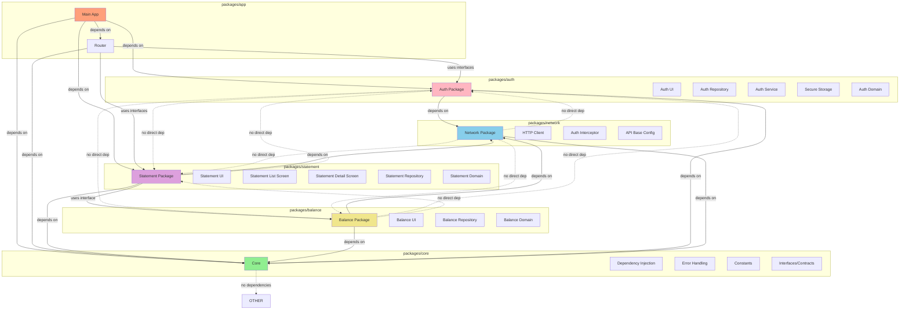
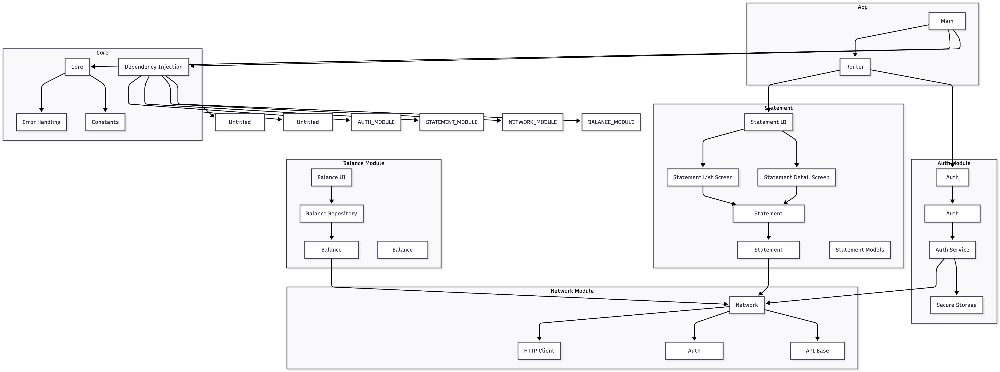

# Arquitetura Modular - Bank Statement App

## Visão Geral

O aplicativo Bank Statement foi desenvolvido seguindo uma arquitetura modular com packages Dart independentes. Cada módulo pode ser compilado, testado e mantido de forma isolada, garantindo builds incrementais e otimizados.

## Diagrama de Arquitetura

## Estrutura de Packages

### Core Package (`packages/core`)
- **Responsabilidade**: Fundação do sistema, interfaces, contratos, DI
- **Independência**: ✅ Zero dependências de outros packages
- **Arquivos principais**:
  - `lib/core/di/injection_container.dart` - Configuração de DI
  - `lib/core/constants/api_constants.dart` - URL base da API
  - `lib/core/errors/` - Classes de exceção e falhas
  - `lib/core/interfaces/` - Interfaces/contratos

### Network Package (`packages/network`)
- **Responsabilidade**: Comunicação HTTP, interceptores
- **Independência**: ✅ Depende apenas de `core`
- **Arquivos principais**:
  - `lib/network/data/datasources/api_client.dart` - Cliente HTTP com Dio
  - `lib/network/data/interceptors/auth_interceptor.dart` - Interceptor de autenticação

### Auth Package (`packages/auth`)
- **Responsabilidade**: Autenticação, armazenamento seguro de tokens
- **Independência**: ✅ Depende apenas de `core` e `network`
- **Arquivos principais**:
  - `lib/auth/data/datasources/auth_remote_datasource.dart` - Endpoint `/auth/`
  - `lib/auth/data/datasources/auth_local_datasource.dart` - Secure storage

### Balance Package (`packages/balance`)
- **Responsabilidade**: Obter e gerenciar saldo calculado
- **Independência**: ✅ Depende apenas de `core` e `network`
- **Arquivos principais**:
  - `lib/balance/data/datasources/balance_remote_datasource.dart` - Endpoint `/balance/`

### Statement Package (`packages/statement`)
- **Responsabilidade**: Lista e detalhe de extratos
- **Independência**: ✅ Depende de `core`, `network` e `balance`
- **Arquivos principais**:
  - `lib/statement/presentation/pages/statement_list_page.dart` - Tela de lista
  - `lib/statement/presentation/pages/statement_detail_page.dart` - Tela de detalhe

### App (`app/`)
- **Responsabilidade**: Orquestração, roteamento, DI final
- **Dependências**: Todos os packages

## Vantagens da Arquitetura Modular

1. **Builds Incrementais**: Apenas módulos modificados são recompilados
2. **Testes Isolados**: Cada package pode ser testado independentemente
3. **Paralelização**: Módulos podem ser compilados/testados em paralelo no CI/CD
4. **Reutilização**: Packages podem ser usados em outros projetos
5. **Desacoplamento**: Módulos não dependem uns dos outros diretamente

